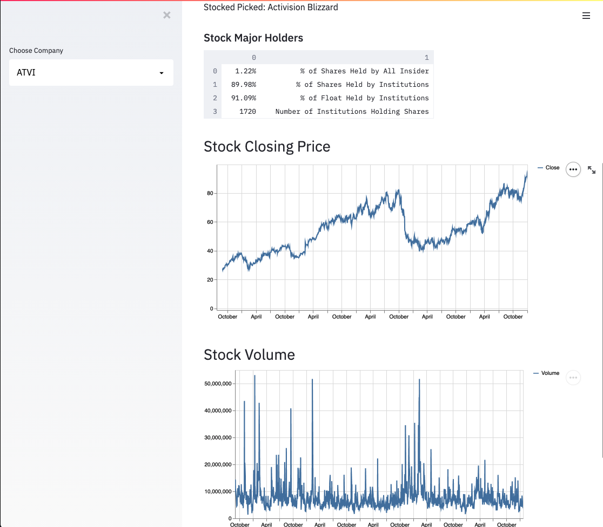

# Stock Price App
# Author: Mauricio Macias (TheErroMaster)

## 0 Installation
Before running anything make sure you have installed Python first.  
Check verions to make sure you have Python 3 downloaded.  
`python3 --version`
Then you will need to create a virtual env: 
`virtualenv env` 
`source env/bin/activate` 
And as well need to install these python modules.  
- `pip install pandas` 
- `pip install streamlit`
- `pip install yfinance`

Run the project with:  

`streamlit run main.py`

Then to leave the virutal env:  
`deactivate`

## 1 Background 

For this project I build a simple stock price app where I can look over a stock closing price and volume. 
I first fetch the data online to get the list S&P 500 companies.
Then made a dropdown to choose a S&P 500 company so I could show its everyday closing price and volume.

## 2 Demostration

